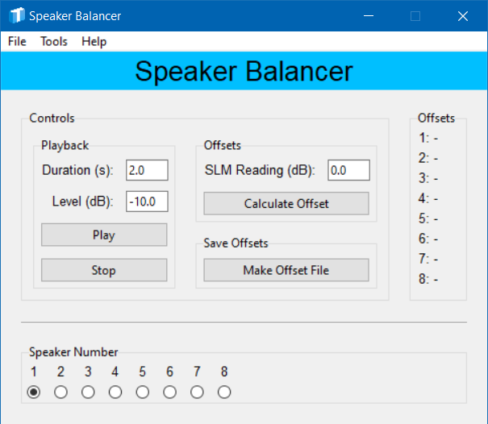
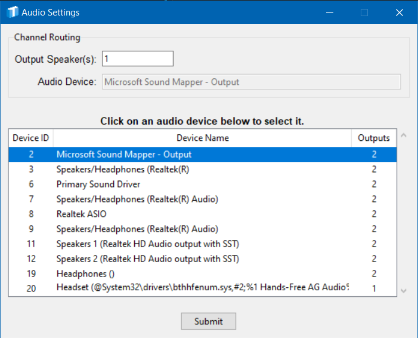
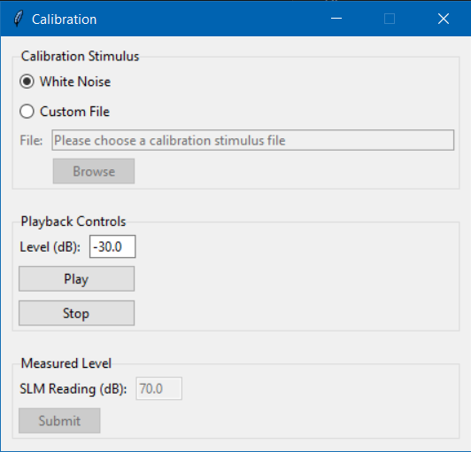

<div style="text-align: center;">
    
</div>

<div style="text-align: center;">
    <h1>Speaker Balancer</h1>

    Written by: <b>Travis M. Moore</b>
    <br>
    Latest version: <b>Version 3.0.0</b><br>
    Originally created: <b>June 20, 2022</b><br>
    Last edited: <b>March 25, 2024</b><br><br>
</div>

---

# Description
The Speaker Balancer is a useful tool for quickly balancing lab speakers using a sound level meter. 

- Select speakers just by clicking. 

- Present a white Gaussian noise to the specified speaker. 

- Calculate offsets (using the first speaker as a reference). Easily save offsets to CSV, and monitor offsets in real time as they appear on screen. 
<br>
<br>

---

# Getting Started

## Dependencies

- Windows 10 or greater (not compatible with Mac OS)

## Installing

- This is a compiled app; the executable file is stored on Starfile at: \\starfile\Public\Temp\MooreT\Custom Software

- Simply copy the executable file and paste to a location on the local machine. 

- **DO NOT RUN FROM THE STARFILE SERVER.** This ties up the program for others, and will result in erratic app behavior. 

## First Use
- **DO NOT RUN FROM THE STARFILE SERVER.** This ties up the program for others, and will result in erratic app behavior. That's right, this statement is identical to the one above - it's just that important!

- Double-click to start the application for the first time.
<br>
<br>

---

# Main Screen
The Speaker Balancer offers all the controls you will need on a single screen for ease of use. Enjoy the sky blue band across the top of the screen - it's almost like being at the beach. 



## Controls
### Playback Group
- Duration (s): The duration of the white noise in seconds

- Level (dB): The scaling factor to apply to the white noise. Adjust this level until the sound level meter reads around 70 dB A (slow). 

- Play button: Begin audio playback.

- Stop button: Stop audio playback.

### Offsets Group
- SLM Reading (dB): The value read from the sound level meter while the white noise is actively playing. 

- Calculate Offset button: Calculates an offset based off of the value from speaker 1 and stores that value. 

## Offsets
The Offsets frame displays the offsets for each speaker as they are calculated. Refer to this section while updating the RME offsets using Total Mix. 

## Speaker Number
The Speak Number group contains buttons for each speaker. Route the white noise to any speaker by clicking the appropriate button. 
<br>
<br>

---

# Tools Menu

## Audio Settings
The Audio Settings window allows you to select an audio device and assign speakers for playback. 

<b>Device Selection.</b> The Audio Settings window displays available audio devices in a table (see lower part of image below). Simply click to choose the desired device. Your selection will be highlighted in blue. 

<b>Speaker Assignment.</b> To assign a speaker for playback, enter the speaker/channel number in the entry box (see upper part of image below). Note that you must provide a speaker for each channel in the audio file. For example, if your stimulus has eight channels, you must provide a list of eight speakers. Separate numbers with spaces when providing a list of speakers. For example: ```1 2 3 4 5 6 7 8```.



## Calibration
The Calibration window provides a simple way to calibrate your stimuli using a sound level meter (SLM). 

<b>Calibration Stimulus.</b> You can choose to use the built-in white noise, or provide a custom file for the calibration signal (top group in image below).

<b>Playback Controls.</b> Use the "Level (dB)" entry box to adjust the playback level in dB FS (middle group in image below). The "Play" and "Stop" buttons allow you to start and stop the audio playback.

<b>Measured Level.</b> Use a SLM to measure the level of the calibration signal and enter the SLM reading into the "SLM Reading (dB)" entry box (bottom group in image below). Click submit, and the application will calculate an offset so that you can specify presentation levels in dB (whichever type of dB you set the SLM to when measuring). Note that the "Submit" button is disabled until you click the "Play" button.


<br>
<br>

---

# Compiling from Source
```
pyinstaller --noconfirm --onefile --windowed --icon "C:/Users/MooTra/Code/Python/tmpy/tmgui/shared_assets/images/logo_icons/logo_full.ico" --add-data "C:/Users/MooTra/Code/Python/tmpy/tmgui;tmgui/" --add-data "C:/Users/MooTra/Code/Python/tmpy/tmdsp;tmdsp/" --paths "C:/Users/MooTra/Code/Python/tmpy/tmdsp" --paths "C:/Users/MooTra/Code/Python/tmpy/tmgui" --hidden-import "pandas" --hidden-import "sounddevice" --hidden-import "soundfile" --add-data "C:/Users/MooTra/Code/Python/balance_speakers2/app_assets;app_assets/"  "C:/Users/MooTra/Code/Python/balance_speakers2/controller.py"
```
<br>
<br>

---

# Contact
Please use the contact information below to submit bug reports, feature requests and any other feedback.

- Travis M. Moore: travis_moore@starkey.com
